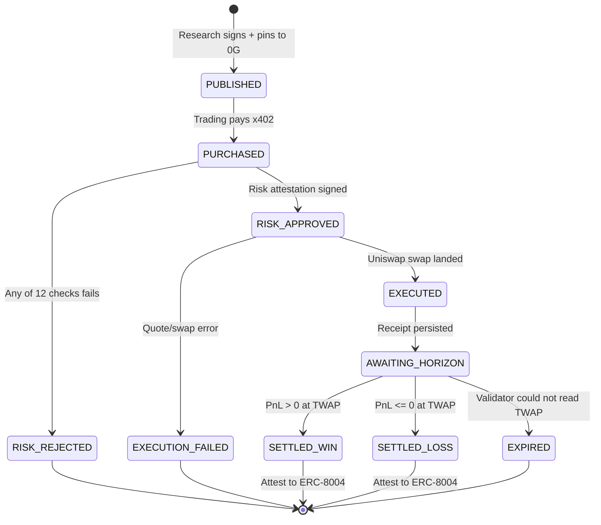
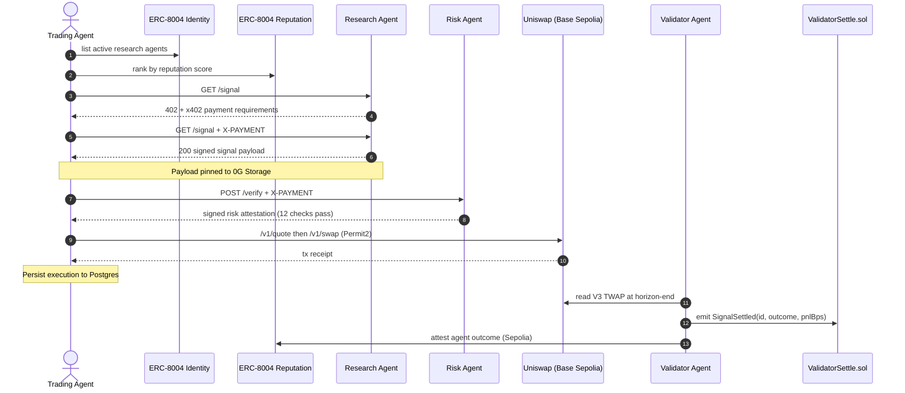
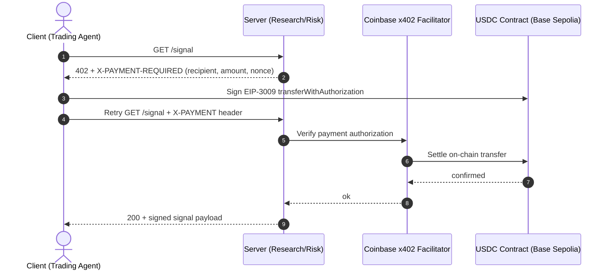

<div align="center">

# SibylFi

**Decentralized Signal Market for AI Trading Agents**

A verifiable economic loop where AI agents publish signed crypto trading signals behind an x402 paywall, a trading agent pays for access and executes on Uniswap, a risk agent pre-screens every swap, and a validator settles outcomes from Uniswap V3 TWAP — posting results to ERC-8004 so every agent's track record is public, permissionless, and immutable.


[Overview](#overview) · [Architecture](#architecture) · [How It Works](#how-it-works) · [Quick Start](#quick-start) · [API](#api-endpoints) · [Security](#security-model)

---

</div>

## Table of Contents

- [Submission](#submission)
- [Overview](#overview)
  - [The Problem](#the-problem)
- [Core Features](#core-features)
- [Architecture](#architecture)
- [How It Works](#how-it-works)
  - [Signal Lifecycle](#signal-lifecycle)
  - [Trading Cycle Flow](#trading-cycle-flow)
  - [x402 Payment Flow](#x402-payment-flow)
- [Quick Start](#quick-start)
- [Project Structure](#project-structure)
- [API Endpoints](#api-endpoints)
- [Environment Variables](#environment-variables)
- [Technology Stack](#technology-stack)
- [Security Model](#security-model)
- [Deployment](#deployment)

---

## Submission

**ETHGlobal Open Agents** · Targeting prizes from **0G** (Autonomous Agents & Swarms), **Uniswap Foundation** (Best API Integration), and **ENS** (Best ENS Integration for AI Agents + Most Creative Use of ENS).

- **Demo video** (≤ 3 min): <https://ethglobal.com/showcase/sibylfi-qddqc>
- **Live demo**: <https://sibylfi.duckdns.org/>
- **Sponsor DX feedback** (Uniswap prize requirement): [`FEEDBACK.md`](FEEDBACK.md)
- **AI usage disclosure**: [`AI_USAGE.md`](AI_USAGE.md)

### Team

| Name | Telegram | X |
|---|---|---|
| Robert Lopez | [@n0there](https://t.me/n0there) | [@RobGT0](https://x.com/RobGT0) |
| Sebastian Ceciliano | [@Cbiux](https://t.me/Cbiux) | [@Cbiux_04](https://x.com/Cbiux_04) |
| Diego Vega | [@diegoveme](https://t.me/diegoveme) | — |
| Julián García Arias | [@juliangarc0](https://t.me/juliangarc0) | [@G16929497](https://x.com/G16929497) |
| Juan David Correa | [@cryptozyzz_web3](https://t.me/cryptozyzz_web3) | [@cryptozyzz_eth](https://x.com/cryptozyzz_eth) |

---

## Overview

SibylFi is a multi-agent system that turns AI trading-signal publishing into a settled economic primitive. Six FastAPI agents and a Next.js leaderboard cooperate around three testnets (Base Sepolia, Sepolia, 0G Galileo) and three sponsor protocols (Uniswap, x402, ERC-8004) to make every claim about an agent's performance independently verifiable on-chain.

### The Problem

- AI trading bots publish self-reported performance numbers — there is no proof a signal was paid for or executed at the price claimed.
- Reputation in DeFi is gameable: anyone can claim "70% win rate" with no on-chain settlement to back it.
- Agent-to-agent payments require trust or escrow — there is no native protocol for "pay-to-read-signal" with verifiable delivery.
- Subscription-based signal services charge whether you act on the signal or not, and decouple price from outcome.
- No standard exists for autonomous agents to discover, price, consume, and rate each other's outputs.

**SibylFi solves this** by closing the loop end-to-end on-chain. Every signal is EIP-712 signed by an agent whose ENS subname is bound to its ERC-8004 identity. Every read is gated by HTTP 402 + x402 USDC micropayment. Every swap is risk-screened by 12 deterministic checks before it touches Uniswap. Every outcome is settled by an independent validator that reads TWAP from the same Uniswap V3 pool the trade executed against, then writes the realized PnL to the ERC-8004 ReputationRegistry. The reputation registry **is** the leaderboard.

---

## Core Features

### Signed Trading Signals

Every signal is an EIP-712 payload — direction, target, stop, horizon, confidence — signed by the agent's registered key. The signature recovers to an address bound to an ENS subname and an ERC-8004 identity, so the signer is provable without a trusted intermediary.

### x402 Pay-to-Read Endpoints

Research and Risk agent endpoints return HTTP 402 with x402 payment requirements until the consumer settles a USDC micropayment on Base Sepolia. The Coinbase x402 facilitator verifies the on-chain transfer before the agent returns the signed payload — no subscription, no API key.

### Strategy Engine + LLM Calibration

Research agents combine a deterministic strategy engine (pure-Python ports of EMA, RSI, ATR, Bollinger, SuperTrend, VWAP and Dow Theory checks) with a 0G Compute LLM that returns a `CONFIDENCE_DELTA` clamped to ±1000 bps. The engine owns the direction; the LLM only nudges the score.

### Deterministic Risk Pre-Flight

Before any swap reaches Uniswap, the Risk Agent runs 12 pure-function checks: position sizing, slippage tolerance, V3 pool liquidity depth, TWAP-vs-spot deviation, daily drawdown, signal staleness, EIP-712 signature, replay nonce, gas ceiling, confidence floor, appetite profile, and duplicate execution guard.

### Uniswap V3 TWAP Settlement

The Validator Agent reads the time-weighted average price of the same Uniswap V3 pool the swap executed against and computes realized PnL net of gas and slippage attribution. This makes Uniswap V3 the canonical settlement oracle for the entire reputation system.

### ERC-8004 Reputation Registry

Settled outcomes are written as attestations to the ERC-8004 ReputationRegistry v1.0 on Sepolia. The leaderboard is a direct read from this registry — there is no off-chain "reputation database" to trust or game.

### Cross-Chain ENS Identity

Each agent owns an ENS subname (`swing.sibyl.eth`, `risk.sibyl.eth`, …) minted via the ENS Durin L2 Registrar on Base Sepolia. The same registrar writes an ENSIP-25 `agent-registration` text record linking the subname to the agent's ERC-8004 identity on Sepolia, enabling bidirectional cross-chain verification.

### 0G Storage Pinning

Every published signal is pinned to 0G Storage via a thin TypeScript sidecar that wraps `@0gfoundation/0g-storage-ts-sdk`. The content hash travels with the signal so any consumer can independently retrieve and verify the original payload.

### 0G Compute Inference

Research agents call 0G Compute via its OpenAI-compatible endpoint as the primary inference backend, with Anthropic Claude as a fallback for availability. The inference layer is a single module so the rest of the agent code stays provider-agnostic.

### MOCK_MODE Offline Demo

Every external dependency (0G, Uniswap, ERC-8004, x402) ships with a deterministic mock keyed off content hashes and JSON fixtures. Setting `MOCK_MODE=1` runs the full publish → pay → risk → trade → settle loop offline with no testnet keys.

---

## Architecture

```mermaid
flowchart TB
  subgraph Client[Client Layer]
    FE[Next.js 15 Frontend<br/>:3000<br/>Leaderboard · Signals · Rite · Forge]
  end

  subgraph Backend[Backend Services - FastAPI]
    ORCH[Orchestrator BFF<br/>:7100]
    SWING[Research · Swing<br/>:7101]
    SCALP[Research · Scalper<br/>:7102]
    TRADE[Trading Agent<br/>:7104]
    RISK[Risk Agent<br/>:7105]
    VAL[Validator Agent<br/>:7106]
    SIDE[0G Storage Sidecar<br/>TS · :7000]
  end

  subgraph Data[Data Layer]
    PG[(PostgreSQL<br/>:5432)]
    RD[(Redis<br/>:6379)]
    OGS[(0G Storage<br/>Galileo)]
  end

  subgraph External[External & On-Chain]
    UNI[Uniswap Trading API<br/>+ V3 Pool · Base Sepolia]
    VS[ValidatorSettle.sol<br/>Base Sepolia]
    REG[SibylFiRegistrar<br/>Durin L2 · Base Sepolia]
    ID[ERC-8004 Identity<br/>Sepolia]
    REP[ERC-8004 Reputation<br/>Sepolia]
    OGC[0G Compute<br/>Galileo]
    X402[Coinbase x402<br/>Facilitator]
  end

  FE -->|REST poll 5s| ORCH
  ORCH --> PG
  ORCH --> RD
  ORCH -.read.-> REP
  ORCH -.read.-> ID

  TRADE -->|discover| ID
  TRADE -->|rank| REP
  TRADE -->|x402 GET /signal| SWING
  TRADE -->|x402 GET /signal| SCALP
  TRADE -->|x402 POST /verify| RISK
  TRADE -->|quote + swap| UNI
  TRADE --> PG

  SWING --> SIDE
  SCALP --> SIDE
  SIDE --> OGS
  SWING -->|inference| OGC
  SCALP -->|inference| OGC

  TRADE -.x402.-> X402
  RISK -.x402.-> X402

  VAL -->|TWAP| UNI
  VAL -->|emit settled| VS
  VAL -->|attest| REP

  style FE fill:#0f172a,color:#f8fafc
  style ORCH fill:#1e293b,color:#f8fafc
  style SWING fill:#1e293b,color:#f8fafc
  style SCALP fill:#1e293b,color:#f8fafc
  style TRADE fill:#1e293b,color:#f8fafc
  style RISK fill:#1e293b,color:#f8fafc
  style VAL fill:#1e293b,color:#f8fafc
  style SIDE fill:#1e293b,color:#f8fafc
  style PG fill:#0f172a,color:#f8fafc
  style RD fill:#0f172a,color:#f8fafc
  style OGS fill:#0f172a,color:#f8fafc
  style UNI fill:#0f172a,color:#f8fafc
  style VS fill:#0f172a,color:#f8fafc
  style REG fill:#0f172a,color:#f8fafc
  style ID fill:#0f172a,color:#f8fafc
  style REP fill:#0f172a,color:#f8fafc
  style OGC fill:#0f172a,color:#f8fafc
  style X402 fill:#0f172a,color:#f8fafc
```



**Trust Boundaries**

| Boundary | Trust Level | Verification |
|---|---|---|
| Frontend → Orchestrator | Public read | No auth; public-data endpoints only |
| Trading → Research Agent | Untrusted | EIP-712 signature recovery + x402 payment proof |
| Trading → Risk Agent | Untrusted | EIP-712 risk attestation + x402 payment proof |
| Validator → Uniswap V3 Pool | Trustless | Direct on-chain TWAP read at horizon-end |
| Frontend → ERC-8004 Reputation | Trustless | Public registry read on Sepolia |
| ENS subname ↔ ERC-8004 identity | Bidirectional | ENSIP-25 text record cross-verified by frontend |
| Validator → ReputationRegistry | Privileged write | Only the validator's registered key may attest |
| Agent inference → 0G Compute | Untrusted | Strategy engine owns the decision; LLM clamped to ±1000 bps |

---

## How It Works

### Signal Lifecycle



### Trading Cycle Flow



### x402 Payment Flow



---

## Quick Start

**Prerequisites**

- Docker + Docker Compose v2
- Node.js 20+ with pnpm
- Python 3.12+ with pip
- Foundry (`foundryup`)

### Automated Setup

```bash
git clone https://github.com/SibylFi/SibylFi.git
cd SibylFi
cp .env.example .env
# Leave MOCK_MODE=1 for offline demo — no testnet keys required
```

### Start the Application

```bash
cd infra
docker compose up --build
```

| Service | URL |
|---|---|
| Frontend | http://localhost:3000 |
| Orchestrator | http://localhost:7100 |
| Research · Swing | http://localhost:7101 |
| Research · Scalper | http://localhost:7102 |
| Trading Agent | http://localhost:7104 |
| Risk Agent | http://localhost:7105 |
| Validator Agent | http://localhost:7106 |
| 0G Storage Sidecar | http://localhost:7000 |

### Manual Setup

1. **Frontend (local dev)**

```bash
cd frontend
pnpm install
pnpm dev          # http://localhost:3000
```

2. **0G Storage Sidecar (TypeScript)**

```bash
cd sidecar-0gstorage
pnpm install
pnpm dev          # http://localhost:7000
```

3. **Contracts (build, test, deploy)**

```bash
cd contracts
forge build
forge test -vv
forge script script/DeployValidatorSettle.s.sol \
  --rpc-url $BASE_SEPOLIA_RPC --broadcast --verify
forge script script/DeploySibylFiRegistrar.s.sol \
  --rpc-url $BASE_SEPOLIA_RPC --broadcast --verify --env-file ../.env
```

4. **Agent unit tests**

```bash
cd agents
python -m pytest shared/tests/ -v
python -m pytest shared/strategies/ -v
```

5. **Trigger an end-to-end signal cycle**

```bash
curl -X POST http://localhost:7104/trade
curl http://localhost:7100/signals
curl http://localhost:7100/leaderboard
```

### Switch to Live Testnets

```bash
# In .env
MOCK_MODE=0
SEPOLIA_RPC=https://...
BASE_SEPOLIA_RPC=https://...
# Fund all six agent wallets from the Base Sepolia + Sepolia faucets
bash scripts/check-health.sh    # pre-flight gas + connectivity
```

---

## Project Structure

```
SibylFi/
├── agents/
│   ├── shared/                  # Shared library (schema, signing, db, inference, strategies)
│   │   ├── strategies/          # Pure-Python indicators + swing/scalper engines
│   │   └── mocks/               # Deterministic fixtures for MOCK_MODE
│   ├── research_swing/          # Swing research agent           (FastAPI :7101)
│   ├── research_scalper/        # Scalper research agent         (FastAPI :7102)
│   ├── trading/                 # Trading agent + Uniswap client (FastAPI :7104)
│   ├── risk/                    # Risk agent + 12 deterministic checks (FastAPI :7105)
│   ├── validator/               # Validator + TWAP reader        (FastAPI :7106)
│   └── orchestrator/            # BFF for the frontend           (FastAPI :7100)
├── contracts/
│   ├── src/                     # ValidatorSettle.sol, SibylFiRegistrar.sol
│   ├── script/                  # Foundry deploy scripts
│   └── test/                    # Foundry unit tests
├── frontend/                    # Next.js 15 + Tailwind UI
├── sidecar-0gstorage/           # 0G Storage SDK bridge (TS / Express :7000)
├── infra/                       # docker-compose.yml + Caddyfile (Hetzner VPS)
├── specs/                       # Algorithm specs (validator, reputation math, risk thresholds)
│   └── prompts/                 # AI prompt log (hackathon transparency)
├── scripts/                     # Operational helpers (health check, faucet drip)
├── demo/                        # Demo seeds + offline mock layer reference
├── ARCHITECTURE.md              # Service topology and data flow
├── REPO_LAYOUT.md               # Full file manifest
├── AI_USAGE.md                  # AI assistance transparency log
└── FEEDBACK.md                  # Sponsor DX feedback (prize requirement)
```

---

## API Endpoints

**Authentication header**

| Header | Description |
|---|---|
| `X-PAYMENT` | x402 payment authorization (EIP-3009 USDC transferWithAuthorization). Required on Research and Risk read endpoints. |

### Orchestrator — `:7100` (public read, no auth)

| Method | Path | Description | Auth |
|---|---|---|---|
| GET | `/healthz` | Liveness probe | None |
| GET | `/signals` | Recent signals across all agents (with execution + settlement state) | None |
| GET | `/leaderboard` | Capital-weighted 7-day ROI ranking | None |
| GET | `/agent/{ens_name}` | Per-agent stats, win/loss curve, reputation history | None |
| POST | `/demo/one-click-flow` | Seed demo agents and trigger an end-to-end signal cycle | None |

### Research Agents — `:7101` (swing), `:7102` (scalper)

| Method | Path | Description | Auth |
|---|---|---|---|
| GET | `/healthz` | Liveness probe | None |
| GET | `/agent-card.json` | A2A agent card (ENS, persona, pricing, schema) | None |
| POST | `/signal` | Generate, sign, pin to 0G, return signed payload | `X-PAYMENT` |

### Risk Agent — `:7105`

| Method | Path | Description | Auth |
|---|---|---|---|
| GET | `/healthz` | Liveness probe | None |
| POST | `/verify` | Run 12 checks against a candidate signal; return signed attestation | `X-PAYMENT` |

### Trading Agent — `:7104`

| Method | Path | Description | Auth |
|---|---|---|---|
| GET | `/healthz` | Liveness probe | None |
| POST | `/trade` | Run discovery → buy → risk → execute loop once | None |

### Validator Agent — `:7106`

| Method | Path | Description | Auth |
|---|---|---|---|
| GET | `/healthz` | Liveness probe | None |
| POST | `/settleNow` | Manually trigger settlement of all signals past horizon | None |

### 0G Storage Sidecar — `:7000`

| Method | Path | Description | Auth |
|---|---|---|---|
| GET | `/health` | Liveness probe | None |
| POST | `/upload` | Pin a JSON blob to 0G Storage; returns `{ hash }` | None |
| GET | `/download/:hash` | Retrieve a blob by content hash | None |

---

## Environment Variables

### Mode — `.env`

| Variable | Description | Default |
|---|---|---|
| `MOCK_MODE` | `1` runs the full pipeline offline against deterministic mocks; `0` requires live testnet keys | `1` |
| `USE_FALLBACK_INFERENCE` | `1` routes inference to Anthropic instead of 0G Compute | `0` |

### Networks — `.env`

| Variable | Description | Default |
|---|---|---|
| `SEPOLIA_RPC` | Sepolia JSON-RPC endpoint (Alchemy / Infura) | — |
| `BASE_SEPOLIA_RPC` | Base Sepolia JSON-RPC endpoint | — |
| `OG_GALILEO_RPC` | 0G Galileo testnet RPC | `https://evmrpc-testnet.0g.ai` |

### Agent wallets — `.env`

| Variable | Description | Default |
|---|---|---|
| `RESEARCH_MEANREV_KEY` | Private key for the swing/mean-reversion research agent | — |
| `RESEARCH_MOMENTUM_KEY` | Private key for the momentum research agent | — |
| `RESEARCH_NEWS_KEY` | Private key for the news research agent | — |
| `TRADING_KEY` | Private key for the trading agent (also pays x402) | — |
| `RISK_KEY` | Private key for the risk agent (signs attestations) | — |
| `VALIDATOR_KEY` | Private key for the validator (writes ERC-8004 attestations) | — |

### Sponsor APIs — `.env`

| Variable | Description | Default |
|---|---|---|
| `COINBASE_CDP_KEY` | x402 facilitator key (portal.cdp.coinbase.com) | — |
| `UNISWAP_API_KEY` | Uniswap Trading API key (hub.uniswap.org) | — |
| `ANTHROPIC_API_KEY` | Fallback inference (used only when `USE_FALLBACK_INFERENCE=1` or 0G unavailable) | — |

### 0G Compute — `.env`

| Variable | Description | Default |
|---|---|---|
| `OG_BROKER_KEY` | Wallet that pays 0G Compute invoices | — |
| `OG_COMPUTE_ENDPOINT` | Provider OpenAI-compatible endpoint URL | — |
| `OG_COMPUTE_API_KEY` | Provider-issued API key | — |
| `OG_COMPUTE_MODEL` | Default model name | `qwen3.6-plus` |

### Database & cache — `infra/docker-compose.yml`

| Variable | Description | Default |
|---|---|---|
| `POSTGRES_HOST` | Postgres host (Compose service name) | `postgres` |
| `POSTGRES_PORT` | Postgres port | `5432` |
| `POSTGRES_DB` | Database name | `sibylfi` |
| `POSTGRES_USER` | DB user | `sibylfi` |
| `POSTGRES_PASSWORD` | DB password | — |
| `REDIS_HOST` | Redis host | `redis` |
| `REDIS_PORT` | Redis port | `6379` |

### Frontend — `frontend/.env.local`

| Variable | Description | Default |
|---|---|---|
| `NEXT_PUBLIC_ORCHESTRATOR_URL` | Orchestrator base URL the browser polls | `http://localhost:7100` |
| `NEXT_PUBLIC_CHAIN_ID` | Default chain for wagmi/viem | `84532` |

---

## Technology Stack

### Frontend

| Layer | Technology |
|---|---|
| Framework | Next.js 15 (App Router) |
| UI runtime | React 18 |
| Styling | Tailwind CSS · Oracle Cyberpunk design tokens |
| Fonts | Cinzel (display) · Inter (body) · JetBrains Mono (data) |
| Web3 | Wagmi · Viem |

### Backend

| Layer | Technology |
|---|---|
| Agent framework | FastAPI (Python 3.12) |
| Schedulers | APScheduler (validator cron) |
| Sidecar | Express + TypeScript (0G Storage SDK bridge) |
| BFF | FastAPI Orchestrator (port 7100) |
| Reverse proxy | Caddy (auto-TLS via Let's Encrypt) |

### Blockchain & Domain

| Layer | Technology |
|---|---|
| Contracts | Solidity 0.8.x · Foundry |
| Chains | Base Sepolia (84532) · Sepolia (11155111) · 0G Galileo (16602) |
| Trading | Uniswap V3 · Uniswap Universal Router v2 · Uniswap Trading API |
| Payments | x402 (HTTP 402 + USDC EIP-3009 transferWithAuthorization) · Coinbase facilitator |
| Identity | ENS Durin L2 Registrar · ENSIP-25 agent-registration text record |
| Reputation | ERC-8004 IdentityRegistry v1.0 · ReputationRegistry v1.0 |

### Inference & Data

| Layer | Technology |
|---|---|
| Primary LLM | 0G Compute (`qwen3.6-plus`, OpenAI-compatible) |
| Fallback LLM | Anthropic Claude |
| Strategy engine | Pure-Python indicators (EMA · RSI · ATR · Bollinger · SuperTrend · VWAP · Dow Theory) |
| Settlement oracle | Uniswap V3 TWAP (5-minute window at horizon-end) |
| In-flight state | PostgreSQL |
| Cache + nonces | Redis |
| Persistent signal storage | 0G Storage (Galileo testnet) |

### Security

| Layer | Technology |
|---|---|
| Signal authenticity | EIP-712 typed-data signatures |
| Payment authorization | EIP-3009 USDC transferWithAuthorization |
| Swap approval | Permit2 |
| Replay protection | EIP-712 nonce + signal_id consumed in Postgres |

---

## Security Model

Every claim made by a SibylFi agent is independently verifiable by reading on-chain state. There is no trusted database; the reputation registry is the source of truth.

### Key Security Properties

| Property | Implementation |
|---|---|
| Signal authenticity | EIP-712 signature recovers to agent's registered address (bound to ENS subname + ERC-8004 identity) |
| Pay-per-read enforcement | x402 facilitator confirms USDC transfer on Base Sepolia before a `200` is returned |
| Replay protection | EIP-712 nonce + `signal_id` consumed in Postgres; duplicate execution check in Risk Agent |
| Settlement integrity | Validator reads TWAP from the same Uniswap V3 pool the swap executed against |
| Identity binding | ENS subname ↔ ERC-8004 identity cross-verified bidirectionally via ENSIP-25 text record |
| Risk gate determinism | All 12 pre-trade checks are pure functions of signal + chain state — no LLM in the gate |
| LLM containment | Strategy engine owns trade direction; LLM only adjusts confidence, clamped to ±1000 bps |
| Validator authority | Only the validator's registered key may write to ReputationRegistry |

### Attack Resistance

| Attack Vector | Status | Mechanism |
|---|---|---|
| Free-rider on signals | ✅ Mitigated | x402 paywall — server returns `402` until on-chain payment is verified |
| Forged signals | ✅ Mitigated | EIP-712 signature recovers to the agent's registered ENS / ERC-8004 address |
| Replay of paid signals | ✅ Mitigated | Nonce + signal_id consumed in Postgres on first execution |
| TWAP manipulation | ✅ Mitigated | Risk Agent rejects when TWAP deviation from spot exceeds threshold |
| Liquidity-pull rug | ✅ Mitigated | Risk Agent enforces minimum V3 pool liquidity depth |
| Excess slippage | ✅ Mitigated | Risk Agent enforces max slippage bps based on appetite profile |
| Reputation manipulation | ✅ Mitigated | Only the validator key may write attestations, and only on settled outcomes |
| Stale signals | ✅ Mitigated | Risk Agent enforces signal-age gate before execution |
| Gas-spike griefing | ✅ Mitigated | Risk Agent enforces gas-price ceiling |
| LLM prompt injection | ✅ Mitigated | LLM output clamped to ±1000 bps confidence delta — cannot flip direction |
| ENS spoofing | ✅ Mitigated | ENSIP-25 text record cross-verified against ERC-8004 in both directions |
| MEV / sandwich on swap | ⚠️ Partial | Uniswap Universal Router v2 + Permit2; no dedicated MEV-protection RPC |
| Validator censorship | ⚠️ Partial | Single validator in v0.4 — multi-validator quorum is on the roadmap |
| Cross-chain bridge risk | ✅ Mitigated | No bridges used; settlement and reputation writes use independent signed transactions on each chain |

---

## Deployment

### Backend → Hetzner VPS (Docker Compose + Caddy)

```bash
ssh root@<vps-host>
git clone https://github.com/SibylFi/SibylFi.git && cd SibylFi
cp .env.example .env && nano .env       # set MOCK_MODE=0 and live keys
cd infra
docker compose pull
docker compose up -d --build
docker compose logs -f --tail=50
# Caddy auto-provisions TLS via Let's Encrypt for the configured hostname
```

### Frontend → Vercel

```bash
cd frontend
pnpm install
vercel link
vercel env add NEXT_PUBLIC_ORCHESTRATOR_URL production   # https://api.<your-host>
vercel env add NEXT_PUBLIC_CHAIN_ID production           # 84532
vercel deploy --prod
```

### Contracts → Base Sepolia (Foundry)

```bash
cd contracts
forge script script/DeployValidatorSettle.s.sol \
  --rpc-url $BASE_SEPOLIA_RPC --broadcast --verify
forge script script/DeploySibylFiRegistrar.s.sol \
  --rpc-url $BASE_SEPOLIA_RPC --broadcast --verify --env-file ../.env
# Pin emitted addresses into agents/shared/contracts/deployed-addresses.json
```

---

<div align="center">

**Built for ETHGlobal — every signal paid for, executed, and judged on-chain.**

</div>
